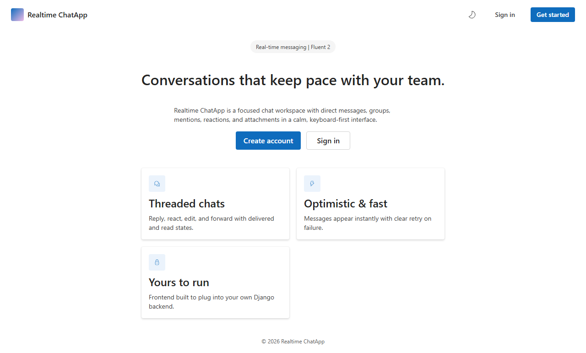
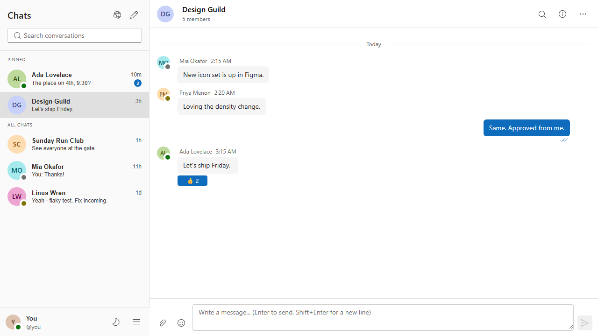
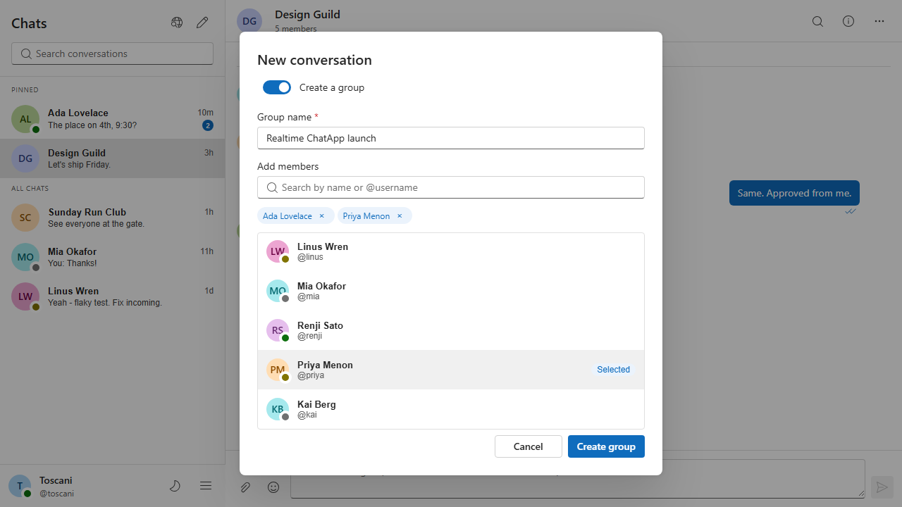

# Realtime ChatApp

Realtime ChatApp is a full-stack real-time messaging application with a React frontend and a Django backend. It combines Fluent UI, Django REST Framework, Channels, and SQLite3 to provide a focused workspace for direct messages and group conversations.

The project includes token authentication, WebSocket delivery, reactions, replies, forwarding, deterministic demo data, Playwright E2E coverage, README screenshots, and GitHub Actions CI.

Repository: [toscani-tenekeu/Realtime_ChatApp_Django_ReactJS_SQLite3](https://github.com/toscani-tenekeu/Realtime_ChatApp_Django_ReactJS_SQLite3)

## Screenshots







## Stack

- React 19 + Vite + Fluent UI
- Django + Django REST Framework + Channels
- SQLite for local development
- Playwright for E2E coverage
- GitHub Actions for CI

## Core features

- Email or username sign-in with token-based auth
- Direct messages and group conversations
- Replies, reactions, forwarding, typing events, and read state
- Profile, password reset, blocked users, and user settings
- Deterministic demo seed for local demos and E2E runs

## Quick start

```powershell
python -m pip install -r backend/requirements.txt
npm install
npx playwright install chromium
python backend/seed_demo.py --reset
python backend/manage.py runserver 127.0.0.1:8000 --noreload
```

In a second terminal:

```powershell
npm run dev -- --host 127.0.0.1 --port 4173
```

Open `http://127.0.0.1:4173/`. The backend API is available at `http://127.0.0.1:8000/api/` and WebSockets at `ws://127.0.0.1:8000/ws/chat/`.

Set `VITE_API_URL` when the backend is hosted elsewhere. Local backend CORS now accepts both `4173` and `4174`, so the app works in normal development and Playwright E2E mode.

## Demo accounts

Run `python backend/seed_demo.py --reset` to recreate all demo data. The script is idempotent and also runs automatically before the E2E suite.

| User         | Email             | Username | Password         |
| ------------ | ----------------- | -------- | ---------------- |
| You          | `you@pulse.app`   | `you`    | `PulseDemo!2026` |
| Ada Lovelace | `ada@pulse.app`   | `ada`    | `PulseDemo!2026` |
| Linus Wren   | `linus@pulse.app` | `linus`  | `PulseDemo!2026` |
| Mia Okafor   | `mia@pulse.app`   | `mia`    | `PulseDemo!2026` |
| Renji Sato   | `renji@pulse.app` | `renji`  | `PulseDemo!2026` |
| Priya Menon  | `priya@pulse.app` | `priya`  | `PulseDemo!2026` |
| Kai Berg     | `kai@pulse.app`   | `kai`    | `PulseDemo!2026` |

## Test commands

```powershell
python backend/manage.py test chat -v 2
python backend/manage.py check
npm run lint
npm run build
npm run e2e
npm run e2e:screenshots
```

`npm run e2e` starts its own backend on `8001` and frontend on `4174`. `npm run e2e:screenshots` regenerates the images embedded above into `docs/screenshots/`.

## GitHub CI

The repository now includes [`.github/workflows/ci.yml`](.github/workflows/ci.yml), which runs lint, build, Django tests, and Playwright E2E on every push and pull request.

## License

This repository is distributed under the MIT license. See [LICENSE](LICENSE).
